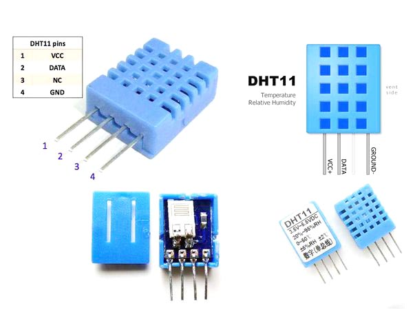

**Projekt BMPT**

**<u>Domácí meteostanice s LCD displejem nokia 5110</u>**

<u>zadání:</u> 

* Vytvoření embedded aplikace pro mikrokontrolér AVR (ATmega16 nebo ATmega328p) v jazyce C (překladač avr-gcc). Minimálně jedna funkce musí být naprogramována v 

* Nejsou specifikovány konkrétní výstupy projektů; jen moduly, HW. Studenti si sami navrhnou demo aplikaci, ve které moduly použijí.

Jako samostatný projekt jsme vytvořili domácí meteostanici, která zobrazuje na displeji **vlhkost** a **teplotu**. K měření jsme využili čidlo **DHT11**, které umožňuje tuto aplikaci. Čidlo má rozsah měřených teplot od 0 °C do 50 °C s přesností ±1 °C a vlhkost měří v rozmezí 20- 90% s přesností ±4 %.

Na obrázku je zobrazeno zapojení jednotlivých pinů čidla DHT11.

K zobrazování využíváme **LCD displej Nokia 5110**, který byl původně určen jako displej pro mobilní telefony. V současné době je ale masově využíván pro projekty postavené na AVR mikrokontrolérech zejména kvůli nízké ceně, jednoduchém komunikačním rozhraní a velké dostupnosti knihoven. Displej využívá kontrolér PCD8544 a disponuje rozlišením 84x48.  

Displej je připojen 8 piny k **arduinu UNO**. 
       
	Graphic LCD Pin -----  Arduino Pin
	1-VCC       ----------------  5V
	2-GND       ----------------  GND
	3-SCE       ----------------  7
	4-RST       ----------------  6
	5-D/C       ----------------  5
	6-DN(MOSI)  ----------------  11
	7-SCLK      ----------------  13
	8-LED       ----------------  9
      
Samotný projekt využívá knihovny pro UART a Makefile od Wykys, knihovnu pro obsluhu displeje od LittleBuster a knihovnu pro vyčítaní hodnot ze senzoru DHT11, která byla napsána podle http://www.electronicwings.com/avr-atmega/dht11-sensor-interfacing-with-atmega16-32.

Adresářová struktura projektu
       
       .
       ├── BMPT_projekt.png
       ├── DHT11_Sensor.jpg
       ├── Makefile
       ├── README.md
       ├── bin
       │   ├── Debug
       │   │   └── BMPT_proj_29_11.lss
       │   ├── EEP.hex
       │   ├── Makefile
       │   ├── PRJ.elf
       │   ├── PRJ.hex
       │   ├── PRJ.lss
       │   ├── asmfunc.o
       │   ├── dependence.list
       │   ├── dht.o
       │   ├── main.o
       │   ├── nokia5110.o
       │   └── uart.o
       ├── lib
       │   ├── dht.h
       │   ├── nokia5110.h
       │   ├── nokia5110_chars.h
       │   ├── settings.h
       │   └── uart.h
       └── src
       ├── asmfunc.S
       ├── dht.c
       ├── main.c
       ├── nokia5110.c
       └── uart.c
