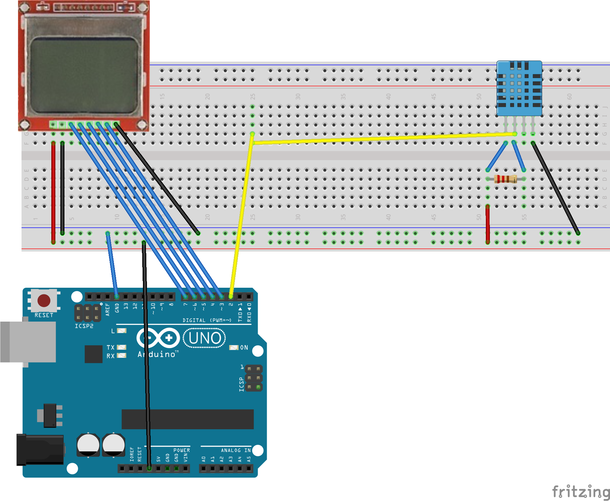

*Projekt BMPT*

**<u>Domácí meteostanice s LCD displejem z mobilního telefonu Nokia 5110</u>**

<u>zadání:</u> 

* Vytvoření embedded aplikace pro mikrokontrolér AVR (ATmega16 nebo ATmega328p) v jazyce C (překladač avr-gcc). Minimálně jedna funkce musí být naprogramována v ASM.

* Nejsou specifikovány konkrétní výstupy projektů; jen moduly, HW. Studenti si sami navrhnou demo aplikaci, ve které moduly použijí.

Jako samostatný projekt jsme vytvořili domácí meteostanici, která zobrazuje na displeji **vlhkost** a **teplotu**, kterou je pomocí klávesnice počítače komunikující přes **UART** možné přepínat mezi stupni **celsia** a **fahrenheita** . Na následujícím obrázku je vidět zapojení celé aplikace. K realizaci jsme využili desku **arduino uno**, která obsahuje mikroprocesor **ATmega328p**. 

Měření jsme realizovali pomocí čidla **DHT11**, které umožňuje tuto aplikaci. Čidlo má rozsah měřených teplot od 0 °C do 50 °C s přesností ±1 °C a vlhkost měří v rozmezí 20- 90% s přesností ±4 %.
Na obrázku je zobrazeno zapojení jednotlivých pinů čidla DHT11.

K zobrazování využíváme **LCD displej Nokia 5110**, který byl původně určen jako displej pro mobilní telefony. V současné době je ale masově využíván pro projekty postavené na AVR mikrokontrolérech zejména kvůli nízké ceně, jednoduchém komunikačním rozhraní a velké dostupnosti knihoven. Displej využívá kontrolér PCD8544 a disponuje rozlišením 84x48.  

Displej je připojen 8 piny k arduinu UNO. 

	Graphic LCD Pin -----  Arduino Pin
	1-RST		----------------  3
	2-CE		----------------  7
	3-DC		----------------  6
	4-DIN		----------------  5
	5-CLK		----------------  4
	6-VCC		----------------  +3V3
	7-LIGHT		----------------  GND
	8-GND		----------------  GND
	
	
      
Samotný projekt využívá knihovny pro UART a Makefile od Wykys, knihovnu pro obsluhu displeje od LittleBuster a knihovnu pro vyčítaní hodnot ze senzoru DHT11, která byla napsána podle http://www.electronicwings.com/avr-atmega/dht11-sensor-interfacing-with-atmega16-32.

Adresářová struktura projektu
       
       .
       ├── BMPT_projekt.png
       ├── DHT11_Sensor.jpg
       ├── Makefile
       ├── README.md
       ├── bin
       │   ├── Debug
       │   │   └── BMPT_proj_29_11.lss
       │   ├── EEP.hex
       │   ├── Makefile
       │   ├── PRJ.elf
       │   ├── PRJ.hex
       │   ├── PRJ.lss
       │   ├── asmfunc.o
       │   ├── dependence.list
       │   ├── dht.o
       │   ├── main.o
       │   ├── nokia5110.o
       │   └── uart.o
       ├── lib
       │   ├── dht.h
       │   ├── nokia5110.h
       │   ├── nokia5110_chars.h
       │   ├── settings.h
       │   └── uart.h
       └── src
       ├── asmfunc.S
       ├── dht.c
       ├── main.c
       ├── nokia5110.c
       └── uart.c

Video

